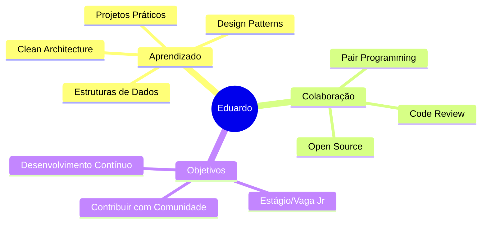

<div align="center">

# 👋 Olá! Eu sou Eduardo Ferreira Serafim

### Desenvolvedor em Formação | Estudante de Graduação | Tech Enthusiast

[](https://github.com/efserafim/)
[](https://www.instagram.com/efserafim/)
[](mailto:efserafim@hotmail.com)


</div>

---

## 🧑‍💻 Sobre Mim

```typescript
const eduardo = {
    nome: "Eduardo Ferreira Serafim",
    idade: 29,
    localização: "Brasil 🇧🇷",
    educação: {
        instituição: "Universidade de Vassouras",
        período: "7º Período",
        status: "Em Andamento"
    },
    foco: ["Desenvolvimento Web", "Engenharia de Software", "Boas Práticas"],
    objetivo: "Transformar ideias em código limpo e eficiente",
    disponível_para: ["Estágios", "Projetos Open Source", "Colaborações"]
};
```

<div align="center">

### 💭 *"Apaixonado por desenvolvimento de software e soluções elegantes"*

</div>

---

## 🛠️ Stack Tecnológico

<div align="center">

### Linguagens de Programação


### Frontend


### Banco de Dados


### Ferramentas & Tecnologias


### Conceitos & Práticas
`POO` • `APIs REST` • `Testes Unitários` • `Clean Code` • `Modelagem de Dados` • `Git Flow`

</div>

---

## 🎓 Formação Acadêmica

<div align="center">

| 🏫 Instituição | 📚 Curso | 📅 Período | 🎯 Status |
|:---:|:---:|:---:|:---:|
| **Universidade de Vassouras** | Graduação em Tecnologia | 7º Período | 🟢 Em Andamento |

</div>

---

## 💼 Projetos em Destaque

<div align="center">

### 🔥 Repositórios que mostram minhas habilidades

</div>

<table align="center">
  <tr>
    <td align="center" width="33%">
      <h3>📋 Projeto A</h3>
      <p><strong>Sistema de Cadastro</strong></p>
      <p>Aplicação Java com persistência de dados e interface intuitiva</p>
      <p>
        
        
      </p>
    </td>
    <td align="center" width="33%">
      <h3>✅ Projeto B</h3>
      <p><strong>To-Do Web App</strong></p>
      <p>Aplicação full-stack com React no frontend e Flask no backend</p>
      <p>
        
        
      </p>
    </td>
    <td align="center" width="33%">
      <h3>📊 Projeto C</h3>
      <p><strong>Análise de Dados</strong></p>
      <p>Visualização e análise de dados com Python e Pandas</p>
      <p>
        
        
      </p>
    </td>
  </tr>
</table>

<div align="center">

### 🔗 *Confira todos os meus projetos no [GitHub](https://github.com/efserafim?tab=repositories)*

</div>

---

## 📊 Estatísticas do GitHub

<div align="center">


</div>

<div align="center">


</div>

---

## 🌟 Destaques & Objetivos

<div align="center">



</div>

### 🎯 Atualmente

- 📚 Aprofundando conhecimentos em **Engenharia de Software** e **Arquitetura Limpa**
- 🔨 Desenvolvendo projetos práticos que aplicam **lógica** e **estruturas de dados**
- 🤝 Aberto a **oportunidades de estágio** e **colaborações em projetos open-source**
- 🌱 Sempre aprendendo e evoluindo através de **hackathons** e **desafios de código**

---

## 📬 Entre em Contato

<div align="center">

### 💬 *Vamos conversar sobre tecnologia, projetos ou oportunidades!*

[](https://github.com/efserafim/)
[](https://www.instagram.com/efserafim/)
[](mailto:efserafim@hotmail.com)

</div>

---

<div align="center">

### ⭐ *Se você gostou do meu perfil, deixe uma estrela nos repositórios!*


</div>
